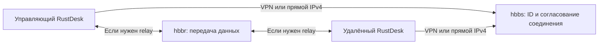

# KeenDesk — RustDesk Server для Keenetic / Netcraze

**KeenDesk** — русская инструкция и установщик официального **RustDesk Server OSS** для роутеров **Keenetic / Netcraze с Entware и ARM64 (aarch64)**. Сервер работает непосредственно на роутере, без Docker и отдельного компьютера. Клиенты — обычный RustDesk.

Проект автоматизирует установку `hbbs`/`hbbr`, создание ключей, автозапуск, перезапуск после сбоя, ограничение журналов и правила firewall. Это самостоятельная обвязка вокруг официальных бинарников RustDesk, а не Pro-версия и не форк сервера. [Происхождение и лицензии](SOURCE-NOTICE.md).

Подробные разделы: [совместная работа с XKeen](docs/XKEEN.md) · [VPN и KeenDNS](docs/VPN.md) · [обслуживание](docs/OPERATIONS.md) · [похожие решения](docs/ALTERNATIVES.md) · [результаты испытаний](TESTING.md).

## Новое в 0.2.0

- Обновление с сохранением ключей, снимком старой версии и откатом при неудачной проверке.
- `rustdeskctl doctor`: процессы, ключи, база, firewall, TCP/UDP и реальный relay-обмен.
- Ограничение повторных падений с сохранением блокировки после reboot.
- [Веб-панель](docs/WEB.md): состояние, диагностика, журналы и копирование клиентских настроек, с отдельным ключом и доступом через VPN/localhost.

[Как обновить 0.1.0 и выполнить откат](docs/UPDATES.md). Фактический статус аппаратных и автоматических проверок приведён в [TESTING.md](TESTING.md).

## Что нужно заранее

- Keenetic/Netcraze с архитектурой **ARM64**. Проверка в SSH: `uname -m` должен вывести `aarch64` или `arm64`. MIPS/MIPSEL и ARMv7 этой версией **не поддерживаются**.
- Установленный Entware, рабочий `/opt`, SSH-доступ к **Entware от root**. Встроенная командная строка KeeneticOS и Linux-shell Entware — разные среды.
- Постоянный накопитель, желательно ext4; не менее **128 МиБ свободно на `/opt` после установки зависимостей**, лучше 256 МиБ и больше для журналов и копий. Python тоже занимает место.
- Рабочие системные часы, DNS и HTTPS-доступ к GitHub и репозиторию Entware.
- Для обновления — минимум **256 МиБ свободно**; большая база и сохраняемые снимки требуют дополнительного места.
- Доступ обоих клиентов к роутеру: через ZeroTier, SSTP/OpenConnect, локальную сеть или публичный IPv4.
- Поддержка netfilter в ядре. Если нужные модули отсутствуют, установщик не запустит сервер без firewall. Компоненты KeeneticOS устанавливаются через веб-интерфейс; установщик не обновляет прошивку.

Чистая установка **GitHub-релиза v0.1.0** проверена на **Keenetic Ultra KN-1811, KeeneticOS 5.1.4, Entware aarch64-k3.10**: автонастройка ZeroTier/XKeen, восстановление процесса, автозапуск после reboot, TCP/UDP RustDesk и передача через relay. Это не обещание совместимости с любым устройством. Подробные результаты и ограничения: [TESTING.md](TESTING.md).

## Установка одной командой

В SSH-shell Entware выполните:

```sh
(set -eu; /opt/bin/opkg update; /opt/bin/opkg install curl ca-bundle; rd_setup="$(mktemp /tmp/rustdesk-install.XXXXXX)"; trap 'rm -f "$rd_setup"' EXIT; curl -fsSL --proto '=https' --tlsv1.2 https://raw.githubusercontent.com/Zhanchuraev/KeenDesk/v0.2.0/install.sh -o "$rd_setup"; /bin/sh "$rd_setup")
```

Команда скачивает завершённый файл и только после успешной загрузки запускает его. Установщик проверяет контрольные суммы своих служебных файлов, скачивает закреплённую версию **RustDesk Server OSS 1.1.16** из официального GitHub Releases, проверяет SHA-256 и тип ARM64 ELF. Глобальный `opkg upgrade` не выполняется.

Если найден **ровно один IPv4-адрес ZeroTier** на интерфейсе `zt…`, он будет выбран автоматически. При неоднозначности или отсутствии ZeroTier установщик спросит адрес и Linux-интерфейсы доступа. Привязку к сети ZeroTier и авторизацию её участников нужно выполнить заранее.

Установщик не создаёт аккаунт ZeroTier, VPN-пользователей, подписки, домены KeenDNS или VPN-серверы. Он настраивает **RustDesk поверх уже работающей сети**. Для каждой установки сервер сам создаёт новую пару ключей: общего ключа для всех пользователей проекта нет.

### Явно заданные параметры

При необходимости можно сначала скачать `install.sh`, а затем передать настройки:

```sh
curl -fsSL https://raw.githubusercontent.com/Zhanchuraev/KeenDesk/v0.2.0/install.sh -o /tmp/rustdesk-entware-install.sh
RD_ADDRESS=10.147.17.1 RD_INTERFACES=zt0 RD_NETWORKS=10.147.17.0/24 /bin/sh /tmp/rustdesk-entware-install.sh
```

**Все IP и интерфейсы в примерах вымышленные: замените их своими.** Адрес выбирается так, чтобы оба клиента могли обращаться к одному серверу. В адресе не нужны `http://`, порт или путь.

| Переменная | Значение |
|---|---|
| `RD_ADDRESS` | IPv4/DNS-имя роутера, которое попадёт в настройки ID и relay |
| `RD_INTERFACES` | Linux-интерфейсы входящего доступа через пробел, например `zt0` или `br0` |
| `RD_NETWORKS` | Допустимые IPv4-подсети **источников** через пробел; пусто — любые источники на указанных интерфейсах |
| `RD_XKEEN` | `auto` по умолчанию; `xkeen` — известная схема обхода; `off` — без специальных DSCP/mark XKeen |

Для шаблона интерфейса, например `ppp+`, обязательна конкретная подсеть VPN. Один только `ppp+` может охватывать и другие PPP-подключения роутера, поэтому установщик не разрешает его без ограничения источников.

Флаг `--check` выполняет предварительные проверки и показывает план без создания серверных служб и правил. Bootstrap при этом всё ещё может установить недостающие зависимости Entware. Если есть старая/чужая установка, проверка остановится с объяснением.

## Что ввести в RustDesk

После установки все значения печатаются в терминале. Показать их повторно:

```sh
rustdeskctl client
```

На **обоих** устройствах: **Настройки → Сеть → ID/Ретранслятор**.

| Поле | Значение |
|---|---|
| Сервер ID | `АДРЕС_РОУТЕРА:21116` |
| Ретранслятор | `АДРЕС_РОУТЕРА:21117` |
| Сервер API | пусто |
| Key | публичный ключ, который вывел установщик |
| Использовать WebSocket | **выключено** |
| Отключить UDP | **выключено** |
| Разрешать небезопасные TLS | **выключено** |

В главном окне подключайтесь к **ID удалённого компьютера**, который показывает RustDesk. Адрес сервера вводится в сетевые настройки, а не вместо ID компьютера. Пароль/подтверждение удалённого доступа задаются на самом удалённом клиенте и не совпадают с серверным публичным ключом.

При работе через VPN оба устройства должны иметь маршрут до `RD_ADDRESS`. Это может быть VPN на каждом компьютере или корректно настроенная маршрутизация через подключённый роутер. Само заполнение полей RustDesk VPN-туннель не создаёт.

Для первой проверки включите на управляющем клиенте постоянное использование ретранслятора, если такая опция доступна. Проверьте экран, управление, передачу файла, простой и повторное подключение. Затем решите, оставлять ли принудительный relay: при разрешённых маршрутах RustDesk может установить прямое соединение между клиентами.

## Если нет белого IP

Это нормальный сценарий: сервер может оставаться за NAT провайдера. Клиентам нужен маршрут к его частному адресу.

| Способ | Нужен белый IP роутера | Использует облако KeenDNS | Что требуется клиентам |
|---|---|---|---|
| ZeroTier | Нет | **Нет**, это отдельная сеть | ZeroTier или маршрут через участника этой сети |
| SSTP-сервер Keenetic | Нет, поддерживается облачный доступ | Да | SSTP-подключение к Keenetic |
| OpenConnect-сервер Keenetic | Нет, поддерживается облачный доступ | Да | OpenConnect/совместимый VPN-клиент |
| Прямой доступ по IPv4 | Да | Можно использовать KeenDNS в **прямом** режиме как DNS-имя | Доступ к портам сервера через Интернет |

SSTP и OpenConnect действительно умеют работать через облако Keenetic при частных IP. Это подтверждено в документации [SSTP](https://support.keenetic.ua/titan/kn-1811/en/19090-sstp-vpn-server.html) и [OpenConnect](https://support.keenetic.com/hero/kn-1011/en/38655-openconnect-vpn-server.html). Скорость такого VPN зависит в том числе от облачного транспорта.

Здесь KeenDNS переносит **VPN-туннель**, а обычный TCP/UDP RustDesk идёт **внутри** него. Это отличается от публикации RustDesk как веб-приложения в KeenDNS. Для описанного варианта не нужны Pro, WebSocket, nginx или HTTP-публикация портов 21116/21117.

Пошаговые варианты, маршруты и правила доступа: **[docs/VPN.md](docs/VPN.md)**.

## Как всё устроено



- **`hbbs`** принимает регистрацию клиентов, сообщает доступность и помогает согласовать соединение. Он также сообщает клиентам адрес relay.
- **`hbbr`** передаёт трафик между клиентами, когда используется ретранслятор. Поэтому объявленный адрес должен быть доступен обоим устройствам.
- **Supervisor** запускается от root, чтобы поддерживать firewall, а серверные процессы запускает с отдельными числовыми UID/GID без root. После сбоев задержки растут: 5, 10, 20, 40 секунд. Пять падений за 10 минут блокируют перезапуски до явного `start`/`restart`; блокировка переживает reboot.
- При загрузке Keenetic может пересоздавать таблицы firewall. NDM-hook ставит флаг, supervisor последовательно восстанавливает собственные правила и проверяет их каждые 30 секунд. Если firewall не готов, серверы не запускаются; при обнаруженной ошибке работающие дочерние процессы останавливаются до восстановления правил.
- Для `hbbs`, `hbbr` и supervisor журналы ограничены: по 2 МиБ и две архивные копии на каждый, около 18 МиБ суммарно. Отдельный `startup.log` содержит сообщения запуска Python.
- Установщик не меняет DHCP, DNS, Wi-Fi, прошивку, основные правила маршрутизации, конфигурации Xray/XKeen или сетевые настройки клиентов RustDesk.

### Порты

| Порт | Протокол | Назначение | Политика установщика |
|---|---|---|---|
| 21115 | TCP | Проверка NAT | localhost и выбранные интерфейсы/подсети |
| 21116 | TCP + UDP | ID, регистрация, согласование | localhost и выбранные интерфейсы/подсети |
| 21117 | TCP | Relay | localhost и выбранные интерфейсы/подсети |
| 21118, 21119 | TCP | Встроенные WS-порты официальных бинарников | Только localhost, извне заблокированы |
| 21114 | TCP | API Pro | Не устанавливается |

По умолчанию автонастройка ZeroTier **не открывает LAN или WAN**. Неуказанные интерфейсы запрещены. Внешний IPv6-доступ закрыт; первая версия проекта рассчитана на IPv4. Процессы могут показывать слушатель `:::21116` — итоговая доступность определяется правилами IPv4/IPv6 firewall.

Сервер находится **на самом роутере**: применяются правила `INPUT`, а не проброс портов на другой компьютер. Установщик использует только собственные цепочки `RDE_INPUT`, `RDE_OUTPUT`, `RDE_NAT` и, при включённой панели, `RDW_INPUT`, не очищает таблицы целиком и не удаляет чужие правила.

### Совместимость с XKeen

Для исходящих пакетов UID RustDesk создаётся отдельное исключение из обработки mangle/nat OUTPUT. Если обнаружена известная схема XKeen, используется существующее правило `fwmark 0xffffa00 → main` и DSCP 62. Никакое новое глобальное `ip rule` не добавляется.

Режим `auto` распознаёт установку с `/opt/etc/init.d/S05xkeen`. При обнаруженном XKeen без ожидаемого правила установка прекращается. `RD_XKEEN=off` допустим, если вы осознанно используете другую маршрутизацию; он не гарантирует выход через физический WAN при произвольной политике роутера. После изменения XKeen проверяйте настоящий обмен данными, а не только список процессов.

**[Подробная инструкция по совместной работе с XKeen](docs/XKEEN.md):** режимы `auto/xkeen/off`, установка XKeen после KeenDesk, маршруты ZeroTier/SSTP/OpenConnect, перезагрузка и восстановление firewall, команды диагностики и проверка реального трафика.

### Файлы

| Путь | Содержимое |
|---|---|
| `/opt/sbin/hbbs`, `/opt/sbin/hbbr` | Официальные ARM64-бинарники |
| `/opt/etc/rustdesk/` | Python-обвязка, `server.json`, маркер владельца установки |
| `/opt/var/lib/rustdesk/` | SQLite-база и ключи сервера |
| `/opt/var/log/rustdesk/` | Журналы |
| `/opt/etc/init.d/S90rustdesk` | Автозапуск Entware |
| `/opt/etc/ndm/netfilter.d/90-rustdesk.sh` | Уведомление об обновлении firewall |
| `/opt/bin/rustdeskctl` | Команда управления |
| `/opt/var/run/rustdesk*` | PID, состояние и lock-файлы |
| `/opt/var/backups/rustdesk-entware/` | Закрытые резервные копии, включая бинарники с 0.2.0 |
| `/opt/var/lib/keendesk-update/` | Снимки, журнал обновления и обработчик восстановления |
| `/opt/etc/rustdesk/web.json` | Необязательная конфигурация панели и секрет входа |

Каталог данных — `700`, приватный ключ — `600`; `hbbs`/`hbbr` используют один ключ и параметр `-k -`. В GitHub публикуется только программа установки: **ключи, пароли, база устройств и настройки вашей сети туда не отправляются**.

## Управление

```sh
rustdeskctl status
rustdeskctl doctor
rustdeskctl client
rustdeskctl logs
rustdeskctl stop
rustdeskctl start
rustdeskctl restart
```

Команды нужно выполнять от root в Entware. `stop` оставляет защитные правила на месте. Полное удаление убирает и собственные цепочки.

Изменить адрес или разрешённые интерфейсы с сохранением ключа:

```sh
rustdeskctl configure --address 10.147.17.1 --interfaces 'zt0' --networks '10.147.17.0/24'
```

Будет сделана копия и перезапущен сервер. Текущие сеансы на это время прервутся. Новый адрес нужно самостоятельно указать в обоих клиентах.

## Резервная копия, удаление, восстановление

```sh
rustdeskctl backup
rustdeskctl uninstall --yes
```

Копия создаётся при остановленных процессах, чтобы база была согласованной. Команда `backup` затем возвращает сервер в прежнее запущенное состояние. `uninstall --yes` сохраняет архив, удаляет сервер и собственные правила, но оставляет зависимости Entware и архив. **Архив содержит приватный ключ: не публикуйте его в Issues или GitHub.**

Повторная установка поверх установки этого проекта показывает существующие параметры; она **не обновляет версию** и не генерирует новый ключ. Для перехода с 0.1.0 используйте bootstrap 0.2.0 с `--upgrade`, для последующих обновлений — `rustdeskctl update`. Автоматический откат сохраняет прежнюю идентичность. [Инструкция](docs/UPDATES.md). Чужая/старая установка без маркера проекта блокирует установку — она не мигрируется автоматически.

Порядок восстановления прежней идентичности и разбор ошибок: [docs/OPERATIONS.md](docs/OPERATIONS.md).

## Где хранятся файлы для установки

1. Этот GitHub-репозиторий — bootstrap, Python-скрипты и инструкция. Команда закреплена на теге `v0.2.0`.
2. Официальный GitHub Releases RustDesk — архив сервера 1.1.16 с закреплённым SHA-256.
3. Репозиторий Entware, настроенный на вашем роутере, — зависимости.
4. Ваш роутер — индивидуальные настройки, ключи, база и журналы.

Отдельный сайт или VPS для раздачи файлов не нужен. Если GitHub недоступен из вашей сети, скачайте файлы по доверенному маршруту и проверьте их целостность; установщик не отключает проверку TLS и не подменяет источник случайным зеркалом.

## Название проекта и совместимость

Проект переименован из `rustdesk-entware` в **KeenDesk**. Команда управления `rustdeskctl`, пути `/opt/…/rustdesk`, цепочки `RDE_*` и внутренний маркер владельца `Zhanchuraev/rustdesk-entware` сохранены для совместимости уже установленных серверов. Переименование не требует переустановки или нового клиентского ключа.

Тег `v0.1.0` сохранён без изменения содержимого: именно этот код прошёл испытание на роутере. В его bootstrap остаются исходные адреса `rustdesk-entware`; после переименования проверены их доступность и контрольные суммы, а также повторный запуск через новый адрес `KeenDesk`. Не создавайте другой репозиторий под прежним именем, пока используете этот релиз: старые ссылки нужны его bootstrap. Актуальная документация находится в ветке `main`.

Идея запуска RustDesk на роутере не новая. В [сравнении похожих решений](docs/ALTERNATIVES.md) приведены пакет Entware, пример Keenetic Community и RouterDesk для ASUSWRT-Merlin.

## Разработка

```sh
python -m unittest discover -s tests -v
python tools/build_bootstrap.py
```

После изменения `src/` нужно пересоздать bootstrap: в нём закреплены SHA-256 служебных файлов. Перед новым релизом обновите версию и ссылки на тег, проведите проверки и опишите фактическую матрицу совместимости. Установку и удаление сначала проверяют в изолированной среде; действующий роутер с чужими сервисами не используется как расходный тестовый стенд.
